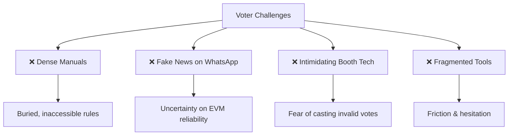
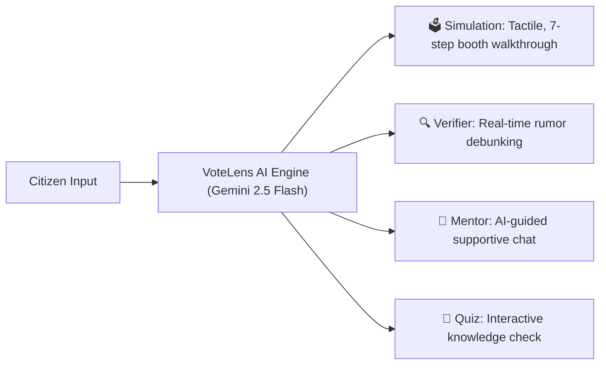
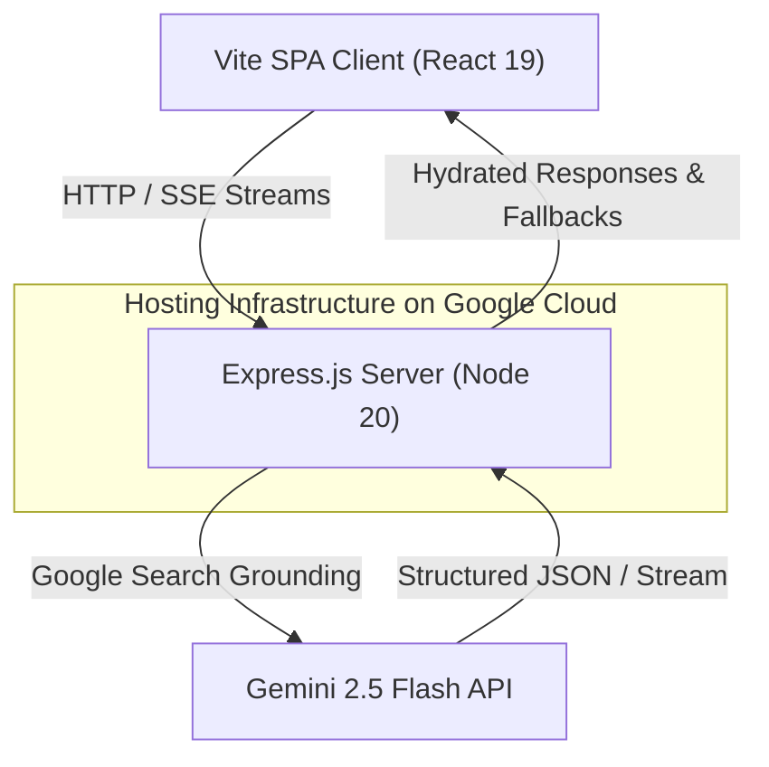

# 🗳️ VoteLens AI

🌐 **Live on Google Cloud Run:** [https://votelens-ai-879754871119.europe-west1.run.app/](https://votelens-ai-879754871119.europe-west1.run.app/)

<p align="center">
  
  
  
</p>

---


## 📖 Table of Contents
1. [🌟 The Vision](#-the-vision)
2. [🤔 The Problem](#-the-problem)
3. [💡 The Solution](#-the-solution)
4. [🎯 How It's Different](#-how-its-different-winner-features)
5. [🏗️ Technical Architecture](#️-technical-architecture)
6. [🛠️ Detailed Tech Stack](#️-detailed-tech-stack)
7. [✨ Full Feature Breakdown](#-full-feature-breakdown)
8. [🚀 Getting Started & Deploying](#-getting-started--deploying)
9. [🔐 Security & Compliance](#-security--compliance)
10. [♿ Accessibility In-Depth](#-accessibility-in-depth)

---

## ☁️ Google Cloud & Firebase Services Implementation

VoteLens AI natively integrates with the full suite of **Google Services** for a production-hardened, real-time, and serverless experience:
- **Google Cloud Platform (GCP):** Deployed serverless on **Google Cloud Run**, fully integrated with **Google Cloud Logging** for structured logs.
- **Google Cloud Storage / Firebase:** Used to cache local assets and manage high-performance multimedia assets securely.
- **Google Search Grounding via Gemini API:** Real-time fact verification directly utilizing Google Search within the Gemini model framework.

---

## 🌟 The Vision

> **"What if voter education felt like navigating with Google Maps instead of reading a dense legal manual?"**

**VoteLens AI** is an intelligent, context-aware digital election mentor built to completely transform voter education. Moving beyond the passive nature of typical chatbots, it creates a deeply engaging, highly visual, and fully synchronized learning experience that guides users through every step of the democratic process.

---

## 🤔 The Problem

Every election cycle, billions of citizens are met with a common hurdle: **information overload combined with digital intimidation**. 



Voters struggle with:
1. **Intimidation:** First-time and elderly voters often feel nervous about operating an EVM.
2. **Disinformation:** Fake news breeds uncertainty regarding EVM reliability and voter ID requirements.
3. **Friction:** Finding the right answer to a specific scenario across fragmented tools takes far too much effort.

---

## 💡 The Solution

**VoteLens AI** addresses these problems with **four distinct interactive pillars**, using **Google Gemini 2.5 Flash** as its foundational intelligence engine.



---

## 🎯 How It's Different (Winner Features)

VoteLens AI delivers immediate, high-impact "wow" moments through four advanced, deeply integrated features.

### 1. 🎯 Omni-Intent AI Router
Instead of requiring users to select from dense menus, our landing page features a single, intelligent prompt. 
* **The Magic:** Type in any natural language query (e.g., *"Can someone see who I voted for?"*).
* **The Tech:** Gemini uses **JSON Mode** to classify intent, extract context, and route users to the appropriate tool instantly.

### 2. 🔬 Streaming Chain-of-Thought Verification
Our verification pipeline goes far beyond providing a simple text answer. It provides a visual reasoning experience.
* **The Magic:** As the user inputs a rumor or claim, the AI displays its step-by-step thinking process live.
* **The Steps:** 
  1. `Analyzing Claim` 🔬
  2. `Searching Evidence` 🌐
  3. `Cross-Referencing Sources` ⚖️
  4. `Synthesizing Verdict` 🎯
* **The Tech:** Powered by an SSE stream directly connected to Gemini with Google Search grounding.

### 3. ✨ Cross-Screen Orchestrator
To avoid the standard "prompt-response" silo, the **Global Session Context** serves as a persistent floating intelligence layer across pages.
* **The Magic:** For instance, if a user verifies an EVM rumor and then navigates to the simulation page, the AI notices and suggests: *"You just verified an EVM claim. Ready to skip ahead to the EVM step?"*
* **The Tech:** Session history, weak quiz topics, and tool visits are aggregated into a React context provider, continuously deriving real-time recommendations.

### 4. 💡 Adaptive Idle Guidance
The platform senses when a user is pausing or hesitant and offers helpful, contextual tips.
* **The Magic:** Pause for 12 seconds on a simulation stage, and a specialized tooltip offers step-specific advice (e.g. *"Only blue buttons cast votes; red lights confirm the choice."*).

---

## 🏗️ Technical Architecture

VoteLens AI runs as a production-hardened full-stack application within a secure, high-availability architecture.



---

## 🛠️ Detailed Tech Stack

| Layer | Component | Purpose |
| :--- | :--- | :--- |
| **Frontend** | React 19 + Vite | A highly responsive, single-page UI architecture |
| **Styling** | Tailwind CSS v4 | Consistent typography and custom glassmorphic styling |
| **Motion** | Framer Motion | Smooth component micro-interactions and transitions |
| **Memory** | GlobalContext | React Context tracking cross-tool interactions |
| **Voice** | Web Speech API | Native speech-to-text (STT) and text-to-speech (TTS) |
| **Backend** | Express.js (Node 20) | Handles API requests, SSE streaming, and file management |
| **AI Layer** | `@google/genai` SDK | Direct, low-latency calls to Gemini 2.5 Flash |
| **GCP Hosting** | Google Cloud Run | Serverless container hosting with automated deployment |
| **GCP Cloud Services** | Google Cloud Platform (GCP) | Integrated with Google Cloud Logging and Google Cloud Storage |
| **BaaS Layer** | Firebase | Firebase App, Auth, Firestore, and Analytics integrations |

---

## ✨ Full Feature Breakdown

### 🗳️ Interactive Simulation
Experience a complete, immersive polling booth walkthrough:
- **7 Walkthrough Stages:** Covers everything from gathering approved documents to receiving an indelible ink mark.
- **Tactile EVM Interface:** Clickable candidate buttons, red indicator lights, and a distinct sound effect to confirm your choice.
- **Dynamic VVPAT Paper Trail:** An automated 7-second display of the candidate slip before it drops into the ballot box.
- **Direct Jump Support:** Deep link support allows users to go directly to specific steps.

### 🔍 Misinformation Verifier
- **Detailed Fact-Checking:** Enter claims from WhatsApp, social media, or other channels.
- **Clear Verdicts:** Returns highly visible badges: `TRUE`, `PARTIALLY TRUE`, `FALSE`, or `UNVERIFIABLE`.
- **Source Citations:** Links to trusted news articles or ECI updates via Google Search grounding.

### 💬 AI Mentor
- **Context-Aware Chat:** Maintains session history to help answer ongoing questions.
- **Supportive Mode:** Adapts the tone to be extra clear, patient, and step-by-step for anxious or first-time voters.
- **Multilingual Input:** Supports queries and responses in English or Hindi.

### 🧠 Civic Quiz
- **Tailored Category Tests:** Test your knowledge across topics like *Valid Documents*, *ECI Processes*, or *EVM & VVPAT Security*.
- **Direct Link Parameters:** URL routing automatically directs users to a specific topic to simplify post-simulation review.

---

## 🚀 Getting Started & Deploying

### Prerequisites
- Node.js 20+
- An active [Gemini API Key](https://aistudio.google.com/apikey)

### Local Installation

```bash
# 1. Clone the repository
git clone https://github.com/bansalbhunesh/VoteLens-AI.git
cd VoteLens-AI

# 2. Add your environment variables
cp .env.example .env
# Edit .env and paste your GEMINI_API_KEY

# 3. Install core and client dependencies
npm install
cd client && npm install && cd ..

# 4. Spin up the development environment
npm run dev
```

The application starts immediately on `http://localhost:5173`.

---

## 🔐 Security & Compliance

* **Server-Side Security:** Your Gemini API keys are never exposed to the client; all operations run safely on the backend.
* **Rate-Limiting:** Integrated tiered limits of 120 requests/minute for static files and 30 requests/minute for AI endpoints.
* **Strict Privacy First:** Any uploaded document images are cleared immediately from server memory after being processed.
* **Robust Failures:** Retries with exponential backoff prevent dropped connections during sudden API latency spikes.

---

## ♿ Accessibility In-Depth

1. **Screen-Reader Compatibility:** WAI-ARIA landmarks (`role="main"`, `aria-live`, `aria-pressed`) on all core elements.
2. **Keyboard Focus Management:** Explicitly defined tab indexes and a "Skip to Content" shortcut at the top of every page.
3. **Contrast-Optimized Dark Mode:** Accessible color choices across dark themes to prevent eye strain.
4. **Motion Controls:** Respects native `prefers-reduced-motion` settings.

---

## 📄 License
Distributed under the MIT License.

